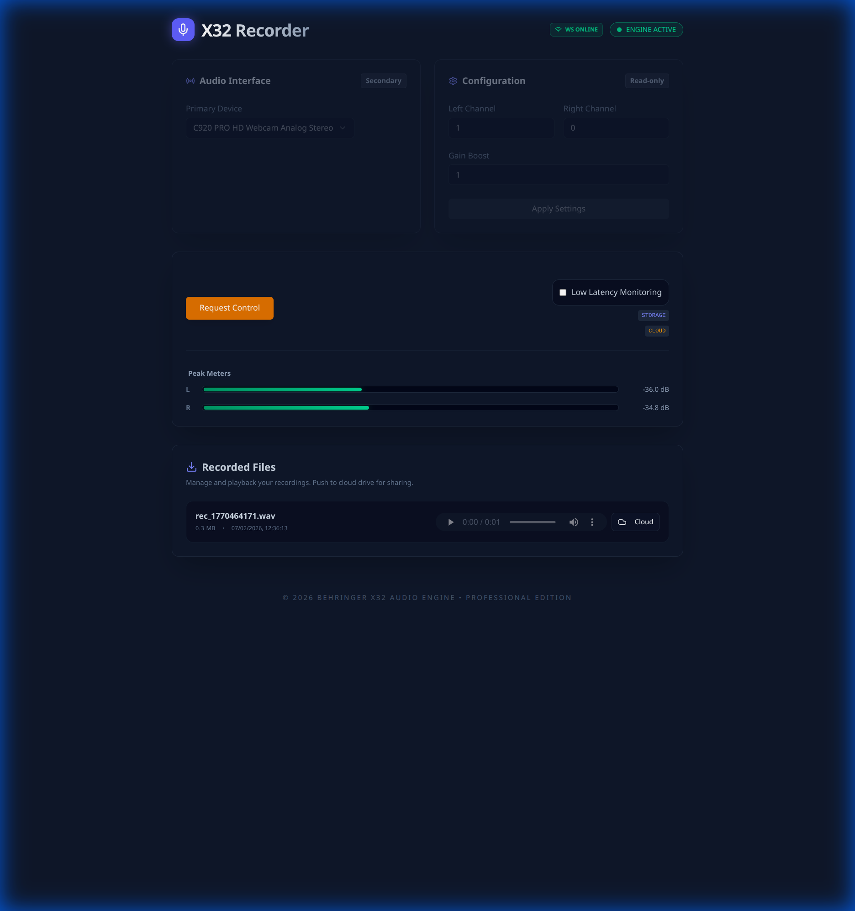
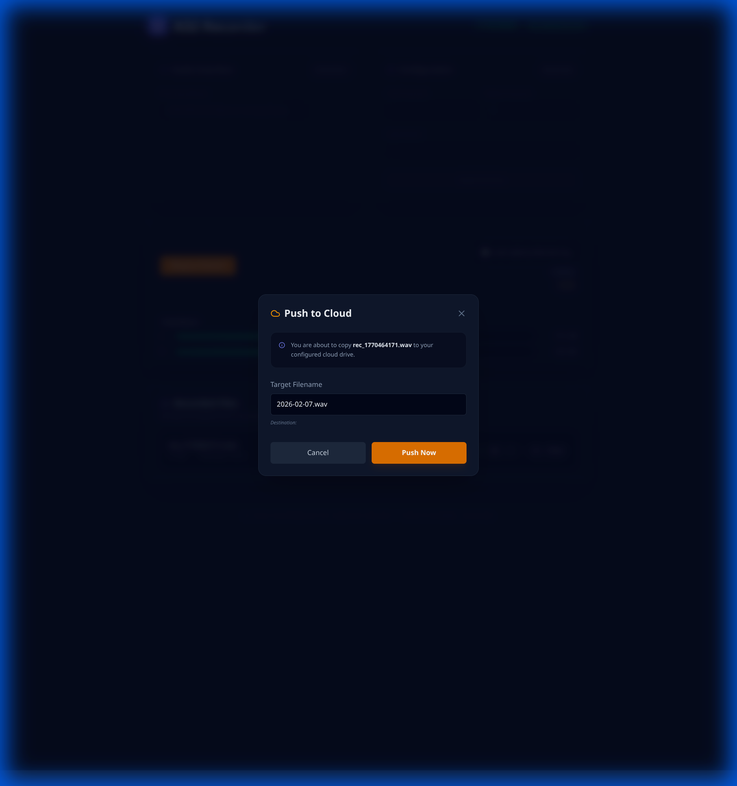

# Behringer Audio Recorder

A high-performance web-based audio recording interface designed for Behringer U-Phoria and similar audio interfaces. Built with Go (backend) and Svelte (frontend).




## Features

- **Real-time Monitoring**: Visual feedback via high-performance dB meters and waveforms.
- **Stereo Recording**: Support for dual-channel recording with configurable routing.
- **Digital Gain Boost**: Adjust input levels digitally before recording.
- **File Management**: List, play back, and manage your recordings directly from the browser.
- **Cloud Integration**: Push recordings to a configured cloud drive location with a click.
- **Multi-Client Sync**: WebSocket-based state synchronization across multiple open tabs.

## Prerequisites

- **Go**: 1.21 or higher
- **Node.js & npm**: For building the frontend
- **PortAudio**: Development headers for audio I/O
  - macOS: `brew install portaudio`
  - Linux: `sudo apt-get install portaudio19-dev`

## Installation & Setup

1. **Clone the repository**:
   ```bash
   git clone <repository-url>
   cd BehringerAudioRecorder
   ```

2. **Build the Application**:
   Use the provided `Makefile` to build both the frontend and backend:
   ```bash
   make build
   ```
   This will install frontend dependencies, build the Svelte app, and compile the Go binary.

3. **Configure**:
   Edit `config.yaml` to set your desired port, sample rate, and storage locations.

## Usage

1. **Run the Server**:
   ```bash
   ./behringer-recorder
   ```
   Alternatively, use `make run` to build and run in one step.

2. **Access the UI**:
   Open your browser and navigate to `http://localhost:8080` (or your configured port).
   For the network port, use the IP address published in the logs

3. **Select Device**:
   Choose your audio interface from the device list and click **Connect**.

4. **Record**:
   Adjust your channels and boost, then hit **Start Recording**. Files are saved as `.wav` in the `recordings` folder.

## Configuration (`config.yaml`)

| Key | Description | Default |
|-----|-------------|---------|
| `port` | Web server port | `8080` |
| `sample_rate` | Audio sample rate | `48000` |
| `buffer_size` | Processing buffer size | `1024` |
| `default_ch_l` | Default left input channel | `0` |
| `default_ch_r` | Default right input channel | `1` |
| `default_boost` | Default digital gain multiplier | `1.0` |
| `storage_location` | Directory for local recordings | `./recordings` |
| `cloud_drive_location` | Target for cloud pushes | `./cloud_drive` |

## Development

- Frontend source is in `frontend/` (Vite + Svelte).
- Backend library code is in `lib/`.
- Core engine logic is in `lib/portaudio/engine.go`.

## License

MIT
